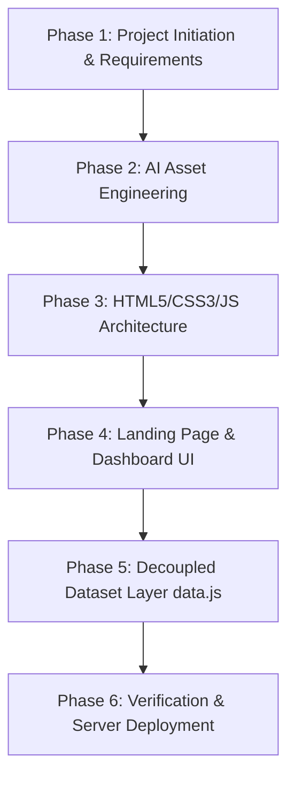

# Construction Intelligent Hub (CIH) - Tech Stack & Architecture Documentation

This document provides a comprehensive technical breakdown of the architecture, data structures, design system, key highlights, and development journey for the **Construction Intelligent Hub (CIH)** web application.

---

## 🛠️ Technology Stack & Data Architecture Overview

The application is engineered using a decoupled, API-ready **HTML5 / CSS3 / ES6+ JavaScript** architecture. Hardcoded data has been completely eliminated from HTML templates and centralized into structured JavaScript data objects (`data.js`), making it seamless to connect real backend REST or GraphQL APIs in the future.

| Layer | Technology Used | Purpose & Rationale |
| :--- | :--- | :--- |
| **Data Layer (API-Ready)** | **JavaScript Data Models (`js/data.js`)** | Centralized dummy dataset (`CIH_DATASET`) & API service abstraction layer (`CIH_API`). Future backend integration requires zero HTML code edits! |
| **Markup & Structure** | **HTML5** | Clean template structure supporting both the public Landing Page (`index.html`) and the Logged-In Dashboard (`dashboard.html`). |
| **Styling & Aesthetics** | **Vanilla CSS3** | Master design system using CSS custom variables, Flexbox & Grid, Glassmorphism (`backdrop-filter: blur(18px)`), Google Fonts (*Plus Jakarta Sans*), and badge color schemes. |
| **Client Controller** | **JavaScript (`js/main.js`)** | Dynamic DOM rendering engine, real-time client-side search filtering, modal popups, and project creation/deletion operations. |
| **Development Web Server** | **Python `http.server`** | Lightweight, zero-dependency local HTTP server delivering static assets with low latency on port `8000`. |
| **Asset Generation** | **AI Asset Pipeline** | Custom generated enterprise telemetry visuals, heavy machinery HUDs, and skyscraper photography. |

---

## 📊 Centralized Data Models (`js/data.js`)

All data displayed across the web application is loaded dynamically from the `CIH_DATASET` state object:

```javascript
// Centralized Data Object Mirroring REST API Responses
const CIH_DATASET = {
    metrics: [ ... ],        // Hero Performance Metrics
    aiModules: [ ... ],      // AI Intelligence Modules
    projects: [ ... ],       // Active Infrastructure Projects
    rfidFeed: [ ... ],       // Live RFID Material Stream
    equipmentAssets: [ ... ] // Heavy Equipment Diagnostics
};

// API Service Wrapper (Ready to replace with fetch('/api/v1/...'))
const CIH_API = {
    getProjects: () => Promise.resolve(CIH_DATASET.projects),
    addProject: (newProject) => { ... },
    deleteProject: (projectId) => { ... }
};
```

---

## 🌟 Key Application Highlights

### 1. Public Landing Page (`index.html`)
- **Sticky Glassmorphism Navbar**: Floating capsule header featuring the `CIH` logo, navigation links (`Home`, `Solutions`, `Resources`, `Pricing`), theme indicator, notification bell, language selector, and a vibrant blue `Log In` capsule button.
- **Hero Section**:
  - `⚡ THE FUTURE OF INFRASTRUCTURE` pill badge.
  - Headline: **"Build Smarter with AI"** (`with AI` in vibrant blue italic typography).
  - Dual CTAs: `Get Started` (solid blue pill) & `▶ Watch Demo` (secondary button).
  - High-tech construction photo overlayed with AI HUD bounding boxes, `"PROJ-PANORAMIC-AI"` tag, floating `"Efficiency Gain +24%"` glass badge, and assistant orb.
- **Dynamic Key Performance Stats Bar**: Rendered directly from `CIH_DATASET.metrics` ($12B+ Projects Managed, 35% Waste Reduction, 500+ Active Job Sites, 150% ROI).
- **Powerful AI Modules Grid**:
  - **AI Cost Estimation**: Predict budget overruns with 98% accuracy (with animated vertical blue bar chart visual).
  - **Material Tracking**: Live RFID & computer vision tracking indicator.
  - **Risk Prediction (Dark Contrast Card)**: Red icon, automated safety/delay forecasting, `Status: Monitoring | ✓ All Clear` badge.
  - **Equipment Intelligence**: Wide card featuring CAT excavator telemetry photo and `Explore Analytics →` link.
- **Why CIH? Value Proposition**: Feature highlights with circular icon bubbles (Save Substantial Time 🕒, Reduce Operational Cost 📉, Precision Planning 🏗️) + Skyscraper aerial photo with floating `🏆 #1 Enterprise Construction AI Platform 2024` badge.
- **CTA Banner & Footer**: Deep blue gradient container (`Ready to Lead the Industry?`) + complete product/company/support footer columns.

---

### 2. Logged-In Project Selection Dashboard (`dashboard.html`)
- **Top Global Navigation Bar**:
  - `CIH` brand logo.
  - **Live Real-Time Search Bar**: `🔍 Search by project or city...` (filters projects dynamically as you type).
  - Action buttons: Light/Dark theme toggle `☀️`, notification bell `🔔` (with red notification dot indicator).
  - User profile section: **Alex Sterling** / *Project Director* with `AS` avatar badge.
- **Left Sidebar Navigation Menu**:
  - **`📊 Dashboard`** (active item highlighted in vibrant blue `#2563EB`).
  - `🏗️ Project Management`, `👥 Team Management`, `💵 Budget`, `📦 Materials`, `⚠️ Risk Analysis`, `🚜 Equipment`, `📊 Reports`, `🤖 AI Insights`, `⚙️ Settings`.
- **Dynamic Project Workspace Grid**:
  1. **Delhi Metro - Phase 4** (New Delhi, India \| Budget: `₹4,200 Cr` \| Deadline: `Oct 24, 2025` \| Status: `On Track` green badge \| Progress: `68%`).
  2. **Mumbai Trans Harbour** (Mumbai, India \| Budget: `₹18,000 Cr` \| Deadline: `Dec 15, 2024` \| Status: `In Review` amber badge \| Progress: `92%`).
  3. **Indore Smart City Hub** (Indore, India \| Budget: `₹850 Cr` \| Deadline: `Jan 10, 2026` \| Status: `Delayed` red badge \| Progress: `35%`).
  4. **International Terminal Exp.** (Bangalore, India \| Budget: `₹12,400 Cr` \| Deadline: `Aug 30, 2025` \| Status: `On Track` green badge \| Progress: `52%`).
- **Expand Portfolio / New Project Container**:
  - Dashed border card with `⊕` icon and a floating **`+ New Project`** button launching a project creation modal that dynamically inserts new projects into the state and re-renders cleanly.

---

## 🗺️ Step-by-Step Development Journey



### Phase 1: Requirements Analysis
- Analyzed reference screenshots for both public landing page and logged-in dashboard view.
- Defined typography requirements (*Plus Jakarta Sans*), color tokens (`#1D4ED8`, `#2563EB`, `#0F172A`, `#F8FAFC`), and component boundaries.

### Phase 2: Asset Engineering
- Generated 3 high-resolution enterprise AI construction assets:
  - `hero_ai.png`: Construction site with cyan/blue telemetry HUD overlays.
  - `equipment.png`: Heavy excavator operating with digital diagnostic HUD overlay.
  - `skyscraper.png`: Top-down perspective aerial view of skyscraper construction.

### Phase 3: Transition to HTML5/CSS3/JS Stack
- Transitioned from Streamlit container limitations to a native HTML5/CSS3/JS stack for unconstrained, pixel-perfect execution.

### Phase 4: Landing Page & Dashboard Implementation
- Built `index.html` and `dashboard.html` with pixel-perfect accuracy to reference screenshots.

### Phase 5: Decoupling Hardcoded Data (`js/data.js` & `js/main.js`)
- Extracted all static inline content into structured dataset models (`CIH_DATASET`).
- Built dynamic rendering functions (`renderProjectGrid()`, `initLandingPage()`, `handleCreateNewProject()`, `handleDeleteProject()`).

### Phase 6: Deployment & Verification
- Tested dynamic project creation, deletion, search filtering, and modal popups.
- Deployed local HTTP web server on port `8000`.

---

## 📁 File Structure

```
d:\Kiran\Construction Intelligent Hub\
├── index.html                    # Public Landing Page Template
├── dashboard.html                # Logged-In Project Selection Dashboard Template
├── TECH_STACK_DOCUMENTATION.md   # Complete Tech Stack & Data Architecture Doc
├── styles/
│   └── style.css                 # Master CSS Design System
├── js/
│   ├── data.js                   # Centralized Dummy Dataset & API Layer
│   └── main.js                   # Client-Side Renderer & Controller
└── assets/
    ├── hero_ai.png               # AI Telemetry Hero Graphic
    ├── equipment.png            # Equipment Telemetry Image
    └── skyscraper.png           # Skyscraper Construction Graphic
```
